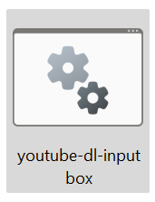
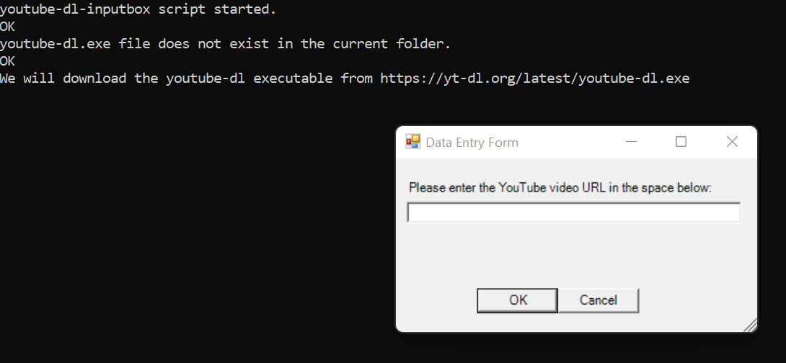

# youtube-dl-inputbox
An input box for youtube-dl downloader written in Windows PowerShell
## Application context
youtube-dl is a command-line program to download videos from YouTube.com. It requires the Python interpreter, version 2.6, 2.7, or 3.2+. There are solutions that offer a GUI (Graphical User Interface) such as [MrS0m30n3/youtube-dl-gui 22] and [jely2002/youtube-dl-gui 22].  

The resulting code called youtube-dl-inputbox.ps1 is a Windows PowerShell script that implements an input box. It does not require Python.
## Instructions
Download the files as a zip using the green button, or clone the repository to your machine using Git.  

In:  

  

Push double click on file. This .bat will execute youtube-dl-inputbox.ps1 Windows PowerShell script.  

  

If your system was unable to run the script because it stated the script was of unknown origin (Internet), copy the code from the Implementation section of this README. After, create the two files locally (youtube-dl-inputbox.ps1 and youtube-dl-inputbox.bat).
## Implementation
In:  

[youtube-dl-inputbox\youtube-dl-inputbox.ps1](youtube-dl-inputbox.ps1)  
```
Add-Type -AssemblyName System.Windows.Forms
Add-Type -AssemblyName System.Drawing

function showMessageWindow {
Param
(
    [string]$Message, 
    [string]$Title, 
    [System.Windows.Forms.MessageBoxButtons]$Button, 
    [System.Windows.Forms.MessageBoxIcon]$Icon
)
    return [System.Windows.Forms.MessageBox]::Show($Message, $Title, $Button, $Icon)
}

$exeFileURL = 'https://yt-dl.org/latest/youtube-dl.exe'
$exeFilePath = '.\youtube-dl.exe'

Write-Output "youtube-dl-inputbox script started."

if (!(Test-Path $exeFilePath -PathType Leaf))
{
    showMessageWindow -Message "youtube-dl.exe file does not exist in the current folder." -Title "Error" -Button OK -Icon Error
    Write-Output "youtube-dl.exe file does not exist in the current folder."

    try
    {
        showMessageWindow -Message "We will download the youtube-dl executable from $exeFileURL" -Title "Information" -Button OK -Icon Information
        Write-Output "We will download the youtube-dl executable from $exeFileURL"
        Invoke-WebRequest -URI $exeFileURL -OutFile $exeFilePath
    }
    catch
    {
        showMessageWindow -Message "Error downloading automatically the youtube-dl executable from $exeFileURL" -Title "Error" -Button OK -Icon Error
        Write-Output "Error downloading automatically the youtube-dl executable from $exeFileURL"
        showMessageWindow -Message "You can download manually the youtube-dl executable from $exeFileURL" -Title "Information" -Button OK -Icon Information
        Write-Output "You can download manually the youtube-dl executable from $exeFileURL"
    }
}

$form = New-Object System.Windows.Forms.Form
$form.Text = 'Data Entry Form'
$form.Size = New-Object System.Drawing.Size(350,200)
$form.StartPosition = 'CenterScreen'

$okButton = New-Object System.Windows.Forms.Button
$okButton.Location = New-Object System.Drawing.Point(75,120)
$okButton.Size = New-Object System.Drawing.Size(75,23)
$okButton.Text = 'OK'
$okButton.DialogResult = [System.Windows.Forms.DialogResult]::OK
$form.AcceptButton = $okButton
$form.Controls.Add($okButton)

$cancelButton = New-Object System.Windows.Forms.Button
$cancelButton.Location = New-Object System.Drawing.Point(150,120)
$cancelButton.Size = New-Object System.Drawing.Size(75,23)
$cancelButton.Text = 'Cancel'
$cancelButton.DialogResult = [System.Windows.Forms.DialogResult]::Cancel
$form.CancelButton = $cancelButton
$form.Controls.Add($cancelButton)

$label = New-Object System.Windows.Forms.Label
$label.Location = New-Object System.Drawing.Point(10,20)
$label.Size = New-Object System.Drawing.Size(310,20)
$label.Text = 'Please enter the YouTube video URL in the space below:'
$form.Controls.Add($label)

$textBox = New-Object System.Windows.Forms.TextBox
$textBox.Location = New-Object System.Drawing.Point(10,40)
$textBox.Size = New-Object System.Drawing.Size(310,20)
$textBox.MaxLength = 92
$form.Controls.Add($textBox)

$form.Topmost = $true

$form.Add_Shown({$textBox.Select()})
$result = $form.ShowDialog()

if ($result -eq [System.Windows.Forms.DialogResult]::OK)
{
    if (!(Test-Path $exeFilePath -PathType Leaf))
    {
        showMessageWindow -Message "Could not execute the youtube-dl.exe file." -Title "Error" -Button OK -Icon Error
        Write-Output "Could not execute the youtube-dl.exe file."
    }
    elseif ($textBox.Text.Length -ne 0)
    {
        $youtubeVideoURL = $textBox.Text
        # List all available formats of requested video
        $optionSelected = .\youtube-dl.exe -F $youtubeVideoURL | Select -skip 4 | Select-Object @{ n='List all available formats'; e={$_} } | Out-GridView -Title "Requested video" -OutputMode Single
        if ($optionSelected -ne $null)
        {
            $optionSelected = -split $optionSelected -split("=")
            $codeSelected = $optionSelected[4]
            Write-Output "Format code selected: $($codeSelected)"
            .\youtube-dl.exe -f $codeSelected $youtubeVideoURL
        } 
    }
    else
    {
        showMessageWindow -Message "YouTube video URL input is not valid." -Title "Error" -Button OK -Icon Error
        Write-Output "YouTube video URL input is not valid."
    }
}
```
In:  

[youtube-dl-inputbox\youtube-dl-inputbox.bat](youtube-dl-inputbox.bat)  
```
@Powershell.exe -executionpolicy remotesigned -File .\youtube-dl-inputbox.ps1
```
## References
[jely2002/youtube-dl-gui 22] jely2002. “A cross-platform GUI of youtube-dl written in Electron and Node.js”. GitHub software repository. December 2022.  
Available at: https://github.com/jely2002/youtube-dl-gui  

[MrS0m30n3/youtube-dl-gui 22] MrS0m30n3. “A cross-platform GUI of youtube-dl written in Python”. GitHub software repository. December 2022.  
Available at: https://github.com/MrS0m30n3/youtube-dl-gui  

[PowerShell/PowerShell 22] Microsoft. “PowerShell”. GitHub software repository. December 2022.  
Available at: https://github.com/PowerShell/PowerShell  

[ytdl-org/youtube-dl 22] ytdl-org. “Command-line program to download videos from YouTube.com and other video sites”. GitHub software repository. December 2022.  
Available at: https://github.com/ytdl-org/youtube-dl  

## Disclaimer
This software is for educational purposes only. It should not be used for illegal activity. The author is not responsible for its use. Do not be a dick.
